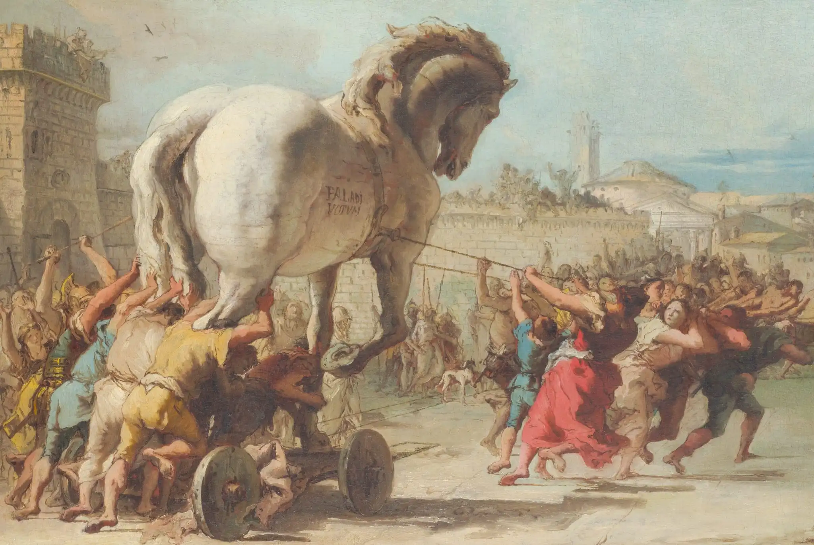
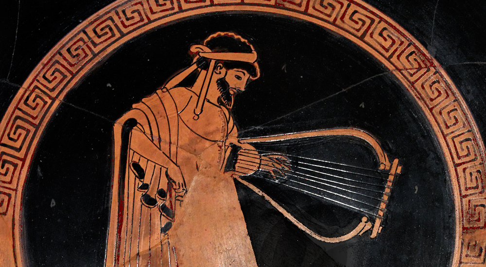

# Homeric Lyre Recitation

This project aims to **recreate Homeric oral performances** by combining Ancient Greek recitation with instrumental accompaniment in the style of traditional Greek music. A user inputs a passage from the *Iliad* or *Odyssey* in Greek, and the system outputs both the spoken verse and a music‑generated lyre melody composed in a style reminiscent of ancient performance. The goal is to evoke the atmosphere of classical recitative embedded in historical musical context.

---

## 1. Historical Background

### 1.1 Ancient Greek Literature: *Iliad* and *Odyssey*

The *Iliad* and the *Odyssey* are two foundational epic poems of Western literature, attributed to Homer and composed in **Homeric Greek** (a blend of Ionic, Aeolic and Attic dialects). They originated in the late 8th or early 7th century BCE and were passed down through oral tradition before being transcribed around the 6th century BCE ([Wikipedia][1]).

* The *Iliad* narrates a brief but intense period near the end of the Trojan War, focusing on Achilles’ wrath and themes of heroism, fate and glory ([Wikipedia][2]).
* The *Odyssey* follows Odysseus on his decade‑long journey home, weaving together supernatural encounters, themes of loyalty and cunning, and the heroic ideal ([Wikipedia][3]).

These epics formed the core of Greek education and cultural identity throughout antiquity.

---

## 2. Ancient Greek Music & Choice of Instrument

Music permeated Ancient Greek life—ritual, theatre, education, social gatherings—and was integral to recitation and narrative performance ([metmuseum.org][4]). Common instruments included the **aulos** (reed pipe) and **lyre** or **kithara**, which accompanied recitations, dances and hymns.

The **lyre**, particularly the tortoiseshell-backed *chelys*, was associated with Apollo and sacred poetry. Typically featuring seven strings, it was essential for amateur and ceremonial performance alike ([metmuseum.org][4], [Wikipedia][5]). Its clear, resonant tone made it ideal to accompany spoken verse—thus naturally suited to supporting Homeric recitation.

We selected the lyre as the instrumental backdrop for our project: historically authentic, tonally compatible with speech, pedagogically symbolic of lyrical poetry and easy to approximate via audio generation models.

---

## 3. Project Progress: MusicGen Lyre Model

Our first major achievement in this project is the creation of a fine‑tuned version of Meta’s **MusicGen** model, trained specifically on Ancient Greek lyre instrumentals. Key milestones include:

* **Dataset collection**: Curated several hundred lyre music tracks—sourced from open archives and scholarly reproductions.
* **Manual annotation**: Each track was labelled for mood, tempo, tonality and form. We also implemented a **dual‑labelling method**, combining individual track descriptors with a universal prompt emphasising musical structure (“melody → variation → return”).
* **Fine‑tuning**: Leveraged the `sakemin/musicgen‑fine‑tuner` on Replicate, with hyperparameter tuning (learning rate, batch size) and prompt conditioning baked in.
* **Initial outputs**: Generated instrumentals that exhibit coherent motif-based structures while retaining lyre‑like timbres.

This **MusicGen\_Lyre** model now serves as the acoustic foundation for recitation accompaniment in the system’s pipeline.

### 3.1 About MusicGen_Lyre

For detailed information, see the [MusicGen_Lyre model card](musicgen_lyre_model_card.md).

### 3.2 Sample Output

*Click the button above to hear examples of Ancient Greek lyre instrumentals generated by our fine-tuned MusicGen model.*

---

## 4. Usage Workflow

Currently the system supports the following flow:

1. **User input**: A passage from *Iliad* or *Odyssey* in Ancient Greek (Unicode Greek script or transliteration accepted).
2. **Recitation synthesis**: The text is converted to spoken audio (via TTS or custom recitation recordings).
3. **Lyre generation**: The fine‑tuned MusicGen model produces a lyre accompaniment, aligned in duration and structure.
4. **Audio merge**: Recitation and music are mixed into a single track to recreate the experience of an oral performance.

---

## 5. Future Directions

We plan to:

* Incorporate **audio seed conditioning** to produce lyre that responds rhythmically to the recitation’s metre.
* Expand dataset to include longer lyre performances, fragments of epinikia (victory odes), dithyrambs, or choral lyric material.
* Interface with **ethnomusicology experts** to refine stylistic authenticity.
* Develop a user-friendly web demo allowing real-time input and combined output.

---

## 6. Ethical & Cultural Reflection

This is a proof‑of‑concept for digitally reviving Ancient Greek tradition—not for commercialization or cultural substitution. Lyrics and musical styles are interpreted through model output and existing recordings, not replicated perfectly. Outputs should be treated as artistic approximations rather than historically precise reconstructions.

---

## 7. License & Citation

This project is released under an open‑source license (e.g. MIT, CC‑BY). If you use or reference the MusicGen\_Lyre model, please cite:

**Richard Jiang**, *Homeric Lyre Recitation* (2025).

[1]: https://en.wikipedia.org/wiki/Homeric_Greek?utm_source=chatgpt.com "Homeric Greek"
[2]: https://en.wikipedia.org/wiki/Iliad?utm_source=chatgpt.com "Iliad"
[3]: https://en.wikipedia.org/wiki/Ancient_Greek_literature?utm_source=chatgpt.com "Ancient Greek literature"
[4]: https://www.metmuseum.org/essays/music-in-ancient-greece?utm_source=chatgpt.com "Music in Ancient Greece - The Metropolitan Museum of Art"
[5]: https://en.wikipedia.org/wiki/Chelys?utm_source=chatgpt.com "Chelys"
